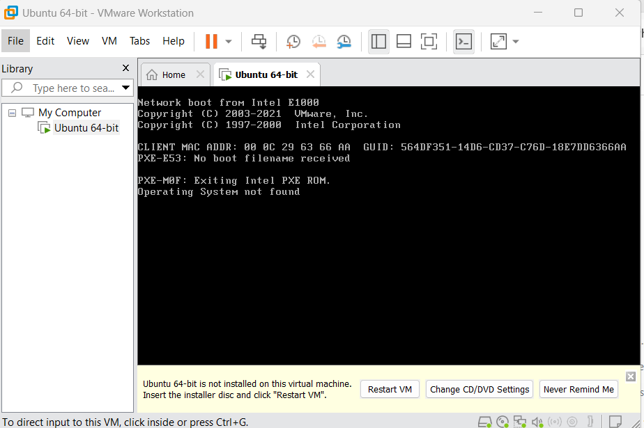
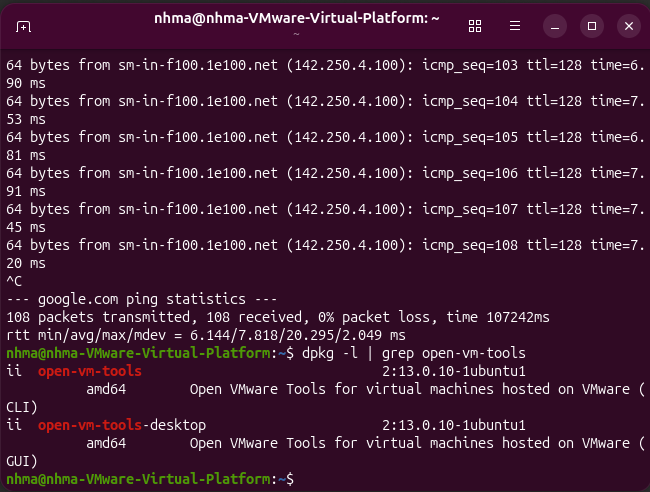

Getting Started

(Based on Getting Started and Obtaining a Linux Environment)

Activities 1a: Installing WMWare Workstation and Linux Environment
 
Initially I had problem installing the Ubuntu as I had downloaded the wrong version for my windows and it was not able to run the VM. 
 

After I re-downloaded again Ubuntu with the correct version then I'm able to run the VM.

